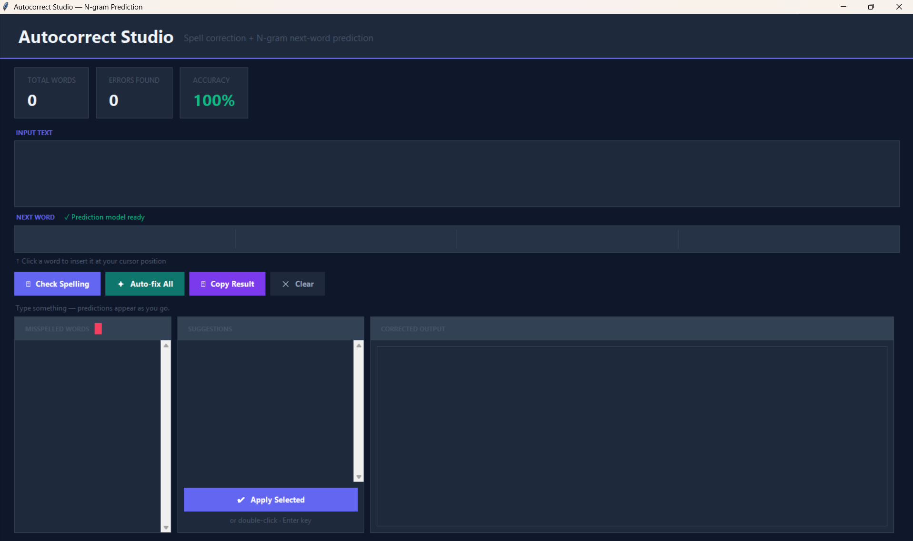
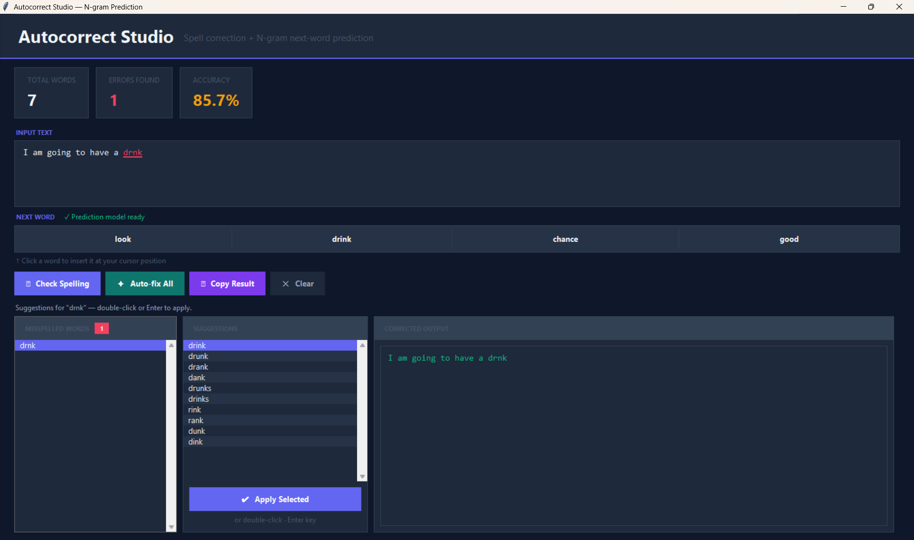
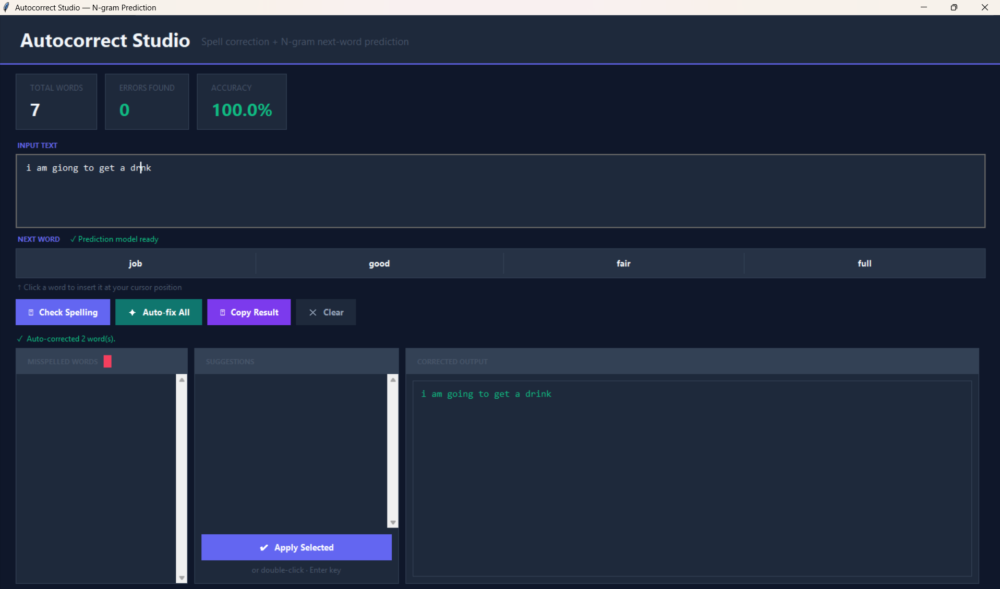
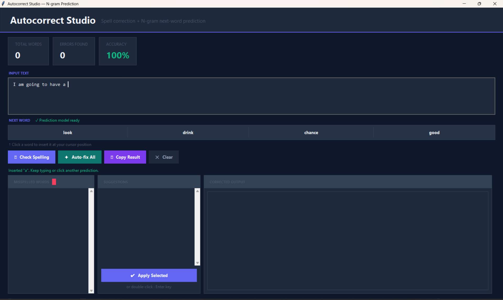

# ShadowFox

# Autocorrect Keyboard System

## ShadowFox AIML Internship - Beginner Task 3

### Project Overview

An intelligent autocorrect keyboard system developed using Python. The application performs spell checking and predicts the next word using N-gram language models.

## Features

- Real-time spell checking
- Automatic correction suggestions
- Bigram and Trigram next-word prediction
- Interactive GUI using Tkinter
- Copy corrected text
- Word statistics and accuracy display

## Technologies Used

- Python
- Tkinter
- NLTK
- TextBlob
- PySpellChecker

## Installation

```bash
pip install -r requirements.txt
python autocorrect_keyboard_v3.py
```

## Screenshots

### Main Interface



### Spell Checking



### Auto Correction



### Next Word Prediction



## Future Improvements

- RNN/LSTM based prediction
- Transformer-based prediction
- Mobile keyboard integration

## Author

Pranav Shyam Nair
